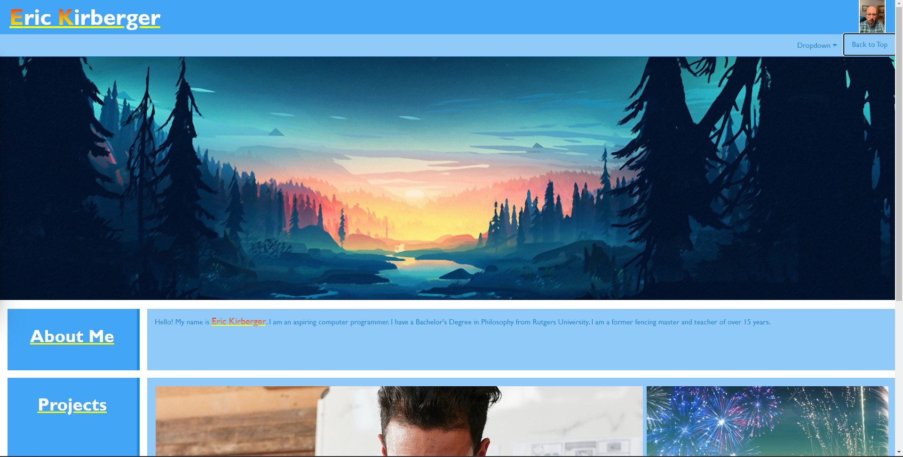

# Eric Kirberger's Portfolio

## Description

Welcome!  This is the first version of my portfolio homepage.  It has many functioning links and even one project already.  This will be an evolving project as I incorporate new skills into its development.  Check back often to see how it's grown and improved.

Portfolio Link: [Eric Kirberger Portfolio](https://ekirbs.github.io/portfolio-homepage/ 'My Portfolio: Learn about my qualifications and how to contact me.')

## Table of Contents
- [Installation](#installation)
- [Usage](#usage)
- [Credits](#credits)
- [License](#license)

## Installation

N/A

## Usage

The Search Bar at the top has a dropdown menu.  Hover over it to see three options:
* About Me
* Sample Work
* Contact Me

    

Click on any of these topics to navigate to the relevant section below.

The navigation bar also has a 'Back to Top' button that you can click at any time to navigate back to the top of the page.

The Projects section has links (coming soon, one working now) to samples of my work.  Clicking on any of them will oepn a new tab to the website of the sample project.

The Contact Section at the bottom has four links you can click on to contact me, or learn more:
* Phone Number (fake right now)
* My email address (real)
* my GitHub Homepage
* My Linkedin Resume

    

## Credits

Traversy Media YouTube channel:  CSS Grid Layout Crash Course

w3schools.com

developer.mozilla.org

Special Thanks to Sam Lerner for inspiration.

## License

Please refer to the license in the repo.